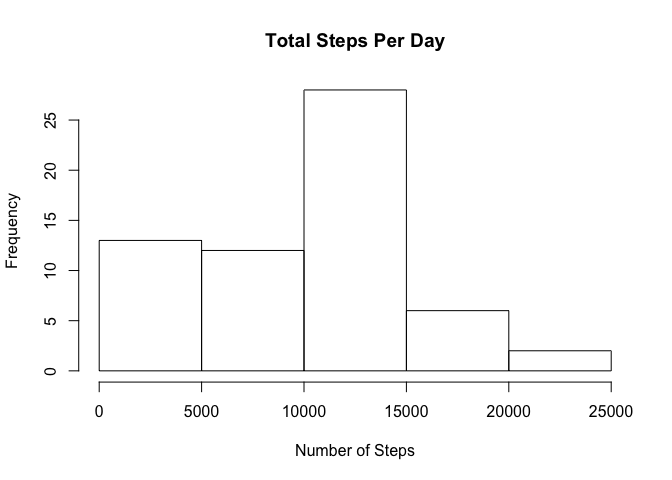
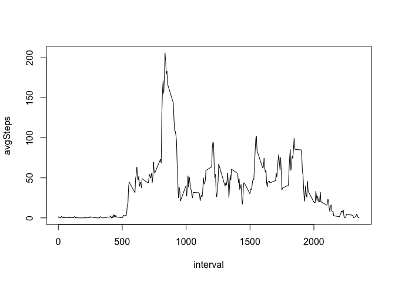
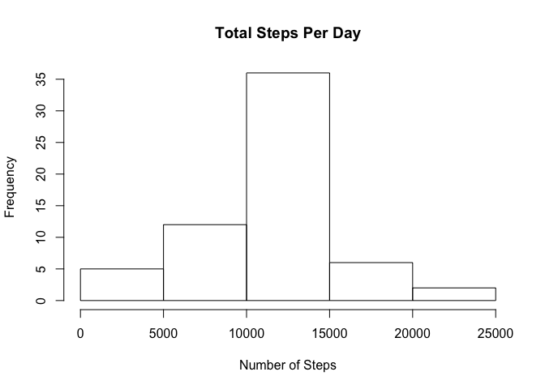

# Reproducible Research: Peer Assessment 1


The following document represents an example of reproducible research. We will analyze a data set about user steps activity from a smart phone.

## Loading and preprocessing the data

```r
url <- "http://d396qusza40orc.cloudfront.net/repdata%2Fdata%2Factivity.zip"
fileName <- "data/activity.zip"
download.file(url, destfile = fileName, method = "curl")

unzip(fileName, exdir = "data")

data <- read.csv("data/activity.csv")
```
## What is mean total number of steps taken per day?

```r
library(dplyr)
summarizedData <- summarise(group_by(data, date),  
    total = sum(steps, na.rm = T)
)

hist(summarizedData$total, main = "Total Steps Per Day", xlab = "Number of Steps")
```

 

```r
paste("Average number of steps", round(mean(summarizedData$total, na.rm= T), digits = 2))
```

```
## [1] "Average number of steps 9354.23"
```

```r
paste("Median number of steps", median(summarizedData$total, na.rm= T))
```

```
## [1] "Median number of steps 10395"
```

## What is the average daily activity pattern?

```r
activityPattern <- summarise(group_by(data,interval), avgSteps = mean(steps, na.rm = T))
with(activityPattern, { plot(interval, avgSteps, type = 'l') })
```

 

```r
activityPattern[activityPattern$avgSteps == max(activityPattern$avgSteps),1]
```

```
## Source: local data frame [1 x 1]
## 
##   interval
## 1      835
```

## Imputing missing values

```r
paste("Total missing values:", sum(is.na(data$steps) == TRUE))
```

```
## [1] "Total missing values: 2304"
```

```r
missingVals <- data[is.na(data$steps),c(2:3)]
hasVals <- data[is.na(data$steps) == FALSE,]
avgInterval <- summarise(group_by(hasVals, interval), steps = ceiling(mean(steps)))

filledData <- inner_join(missingVals, avgInterval, by = 'interval')

newData <- rbind(hasVals, filledData)

# Report on data set with filled in values
summarizedData <- summarise(group_by(newData, date),  
    total = sum(steps, na.rm = T)
)

hist(summarizedData$total, main = "Total Steps Per Day", xlab = "Number of Steps")
```

 

```r
paste("Average number of steps", round(mean(summarizedData$total, na.rm= T), digits = 2))
```

```
## [1] "Average number of steps 10784.92"
```

```r
paste("Median number of steps", median(summarizedData$total, na.rm= T))
```

```
## [1] "Median number of steps 10909"
```

## Are there differences in activity patterns between weekdays and weekends?

